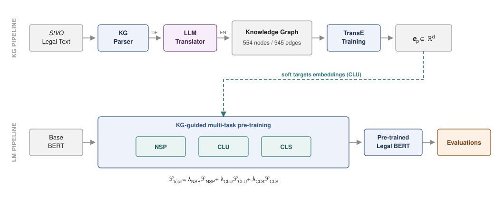

<div align="center">

# 🚦 StVO-LLM-Driver

### Enhancing Legal Reasoning in Pre-trained Language Models via Knowledge Graph-Guided Multi-Task Pre-training

**Legal language models treat statutory text as flat token sequences. It isn't flat.**
This repository injects the *structure* of German road traffic law directly into model weights — and shows it could be transfered across languages, jurisdictions, and legal domains.

[](https://www.python.org/)
[](https://pytorch.org/)
[](https://huggingface.co/docs/transformers)
[]()
[]()
[]()

</div>

---

## 🎯 TL;DR

| | |
|---|---|
| **Problem** | Legal PLMs rely on masked language modeling alone. They ignore the hierarchical and cross-referential constraints that make statutory text *legal* text. |
| **Approach** | Parse the German *Straßenverkehrs-Ordnung* (StVO) into a knowledge graph, embed it with TransE, and use those embeddings as **soft targets** across three complementary pre-training objectives. |
| **Result** | **+10.3 % to +155.0 %** relative gain over baselines on StVO QA · **new SOTA on 4 LexGLUE metrics** · **+3.4 % to +15.8 %** zero-shot on Austrian driving regulations. |
| **Key insight** | Structural knowledge learned in **German** surfaces through an **English** classification head — cross-lingual transfer without ever showing the model English legal structure. |

---

## Architecture

Two pipelines converge: one distills the law into geometry, the other teaches a language model to read that geometry.

<div align="center">
  
</div>

German StVO legal text is parsed, translated via an LLM translator, and structurally aligned with a corresponding English-based knowledge graph, injecting explicit relational constraints into model reasoning. The TransE paragraph embeddings enter the LM pipeline as **soft targets for the CLU objective** — the only coupling between the two pipelines, and the mechanism by which legal structure reaches the model weights.

The total objective is a weighted sum over the unit simplex:

$$\mathcal{L}_{total} = \lambda_{NSP}\mathcal{L}_{NSP} + \lambda_{CLU}\mathcal{L}_{CLU} + \lambda_{CLS}\mathcal{L}_{CLS}, \qquad \sum\lambda = 1.0$$

### The three objectives

| Task | Signal | What it teaches |
|:--|:--|:--|
| **NSP** — Next Sentence Prediction | Positive pairs from consecutive sentences *within* a paragraph; negatives sampled cross-paragraph | Document coherence and paragraph boundaries |
| **CLU** — KG-Guided Clustering | Margin-based contrastive loss pulling a segment toward its source paragraph's TransE embedding, pushing it from a random negative | Relational geometry — structurally related paragraphs (§ 8 and § 9 on right-of-way) already cluster together in TransE space |
| **CLS** — KG-Aware Classification | Binary correctness of a (question, answer) pair, decided through gated attention over the full paragraph-embedding set | Task-aligned reasoning grounded in the actual statute |

**CLU** is the conceptual core. Because the target `e⁺` is a 500-dimensional continuous vector rather than a discrete label, *the gradient carries relational geometry* — the model learns a continuous range of legal concepts instead of hard class boundaries.

### Gated KG-aware attention

The CLS head does not rely on the self-contained encoder representation. It queries the whole paragraph-embedding library at decision time:

$$\alpha_j = \text{softmax}\left(\frac{\mathbf{z}_s^\top \mathbf{e}_j}{\sqrt{d_h}}\right), \quad \mathbf{c}_{KG} = \sum_j \alpha_j \mathbf{e}_j$$

$$\tilde{\mathbf{z}}_s = g \odot \mathbf{c}_{KG} + (1-g) \odot \mathbf{z}_s, \quad g = \sigma([\mathbf{z}_s; \mathbf{c}_{KG}]W_g)$$

Unlike retrieval-augmented generation, there is **no discrete database lookup at inference** — retrieval happens in latent space and is fully differentiable. The gate `g` can drive the KG contribution to zero when the retrieved context is uninformative, so the mechanism degrades gracefully rather than injecting noise. Implementation: [`multi_task_classes_STvO_mlm_clm_clu_cls.py`](multi_task_classes_STvO_mlm_clm_clu_cls.py).

---

## Results

### Main — synthetic StVO QA

Multi-task pre-training (PT) is **zero-shot**; FT adds a few downstream samples. Gains are largely decoupled from base performance, which is the evidence that the objectives — not a strong starting point — are doing the work.

| Model | Base m-F1 | **PT m-F1** | PT Gain | Bal. Acc. | FT m-F1 |
|:--|--:|--:|--:|--:|--:|
| *Top performers (m-F1 > 0.8)* |
| `bert-base-echr` | 0.566 | **0.864** | +0.298 | 0.864 | 0.912 |
| `bert-base-eurlex` | 0.338 | **0.862** | **+0.524** | 0.864 | 0.909 |
| `bert-base-contracts` | 0.475 | **0.845** | +0.370 | 0.848 | 0.905 |
| `custom-legalbert` | 0.467 | **0.820** | +0.353 | 0.820 | 0.900 |
| `Italian-Legal-BERT` | 0.514 | **0.813** | +0.299 | 0.815 | 0.893 |
| *Moderate* |
| `google-bert-base` | 0.425 | 0.630 | +0.205 | 0.666 | 0.919 |
| `legal-bert-base` | 0.456 | 0.569 | +0.114 | 0.617 | 0.888 |
| *Limited* |
| `legal-bert-small` | 0.486 | 0.537 | +0.050 | 0.545 | 0.892 |
| `Legal-heBERT` | 0.336 | 0.435 | +0.099 | 0.548 | 0.870 |

`bert-base-eurlex` climbs from the **weakest** base (0.338) to 0.862. Counterintuitively, general-purpose `google-bert-base` gains more (+0.205) than the broad multi-field `legal-bert-base` (+0.114) — we attribute this to *domain-specific interference*, where many legal-English tasks conflict with the StVO domain, while single-subfield specialists (echr, eurlex) align cleanly.

### Cross-lingual transfer (RQ1)

NSP and CLU are trained on **non-translated German** StVO; only the CLS head sees English. Any zero-shot gain is therefore German-learned structure surfacing in English.

| Model | Base | **PT (zero-shot)** | Gain |
|:--|--:|--:|--:|
| `bert-base-eurlex` | 0.338 | **0.837** | **+0.499** |
| `google-bert-base` | 0.425 | **0.773** | +0.347 |
| `bert-base-contracts` | 0.475 | **0.694** | +0.219 |
| `legal-bert-base` | 0.456 | **0.599** | +0.144 |
| `Italian-Legal-BERT` | 0.514 | **0.608** | +0.094 |

`bert-base-eurlex` barely improves with further fine-tuning (+0.032) — the German NSP+CLU signal was already sufficient. Models that fail zero-shot recover fully once fine-tuned, all converging to a narrow 0.862–0.878 band.

### Out-of-domain legal transfer (RQ3) — LexGLUE

Trained **exclusively on German traffic law**, the models set new SOTA on four metrics across four English legal tasks:

| Model | ECtHR-A µ-F1 | ECtHR-B µ-F1 | UNFAIR-ToS m-F1 | CaseHOLD F1 |
|:--|--:|--:|--:|--:|
| Legal-BERT *(published)* | 70.0 | 80.4 | 83.0 | 75.3 |
| CaseLaw-BERT *(published)* | 69.8 | 78.8 | 82.3 | 75.4 |
| **BERT-ECHR + StVO** | **72.7** † | **81.0** † | 82.5 | 71.9 |
| **Custom-LegalBERT + StVO** | 71.2 | 78.6 | **86.0** † | **77.0** † |

† new SOTA over the published baselines of Chalkidis et al. (2021). The models show negative transfer on SCOTUS, EUR-LEX, and LEDGAR — reported in full rather than omitted.

### Ablation — which objective matters?

Average m-F1 drop when each objective is removed, across all nine models:

| Removed | Mean drop | Significance |
|:--|--:|:--|
| **CLS** | **0.277** | t(8) = 4.35, *p* < 0.01 |
| **NSP** | 0.105 | t(8) = 2.52, *p* < 0.05 |
| **CLU** | 0.056 | t(8) = 1.76, *p* = 0.11 (n.s.) |

The full NSP+CLU+CLS configuration wins for **7 of 9** models. CLS dominates because it aligns directly with the downstream task. CLU's aggregate effect is not statistically significant — it helps top performers (`bert-base-echr`: 0.587 → 0.864) but interferes in `bert-base-contracts` and `google-bert-base`, where random negative sampling can pair semantically related paragraphs as negatives. **Task synergy is architecture-dependent, and we report that honestly.**

---

## Datasets

| Dataset | Size | Role |
|:--|:--|:--|
| **StVO knowledge graph** | 554 nodes · 945 edges · 5 relations | `HAS_PARAGRAPH`, `HAS_SENTENCE`, `HAS_SECTION`, `HAS_SIGN`, `HAS_TABLE` |
| **Synthetic StVO QA** | 12,554 pairs → 10,245 train / 2,309 test | Paragraph-level split (49 train / 10 test §, **zero overlap**) |
| **Irish theory test** | 890 questions → 625 textual → 2,500 samples | Zero-shot in-domain transfer |
| **Austrian ÖAMTC** | 1,954 questions → 963 textual → 3,852 samples | Zero-shot in-domain transfer |
| **LexGLUE** | 7 English legal tasks | Out-of-domain legal transfer |

### Synthetic QA generation

[`legal_qa_generation_multi_lingual.py`](legal_qa_generation_multi_lingual.py) prompts Mistral-7B-Instruct and Llama-3.1-8B to produce, for each StVO sentence, a *source-grounded correct* answer and a *plausible but contradictory* incorrect one.

A **six-stage validation pipeline** then filters them — structural and field constraints, rejection of non-reasoning yes/no questions, domain-terminology verification (*Vorfahrt*, right of way), lexical-overlap removal of trivial paraphrases, and placeholder detection. Only pairs scoring **Q ≥ 0.6** on a composite metric survive. Validation and analysis tooling lives in [`data/synthetic-data-eval/`](data/synthetic-data-eval/).

Critically, **17 % of paragraph identifiers are reserved exclusively for testing**, so the model cannot exploit content memorisation — the split is by *paragraph*, not by pair.

> **Example — § 8 Right of way**
> *Source:* "At intersections without traffic signs or lights, vehicles coming from the right have right-of-way."
> ✅ **Correct:** Q: "Which vehicle has priority at an unmarked intersection?" → A: "…vehicles approaching from the right have right-of-way."
> ❌ **Incorrect:** Q: "Who must yield at an intersection without signals?" → A: "The vehicle traveling at lower speed must always yield to faster-moving traffic." *(contradicts the right-hand priority rule)*

---

## Repository layout

```
├── legal-parser/                 Stage 1 — legal text → knowledge graph
│   ├── main_content_extractor.py     Structured content extraction
│   ├── table_content_extractor.py    Tables and traffic-sign figures
│   ├── citator.py                    Cross-reference / citation resolution
│   ├── knowledge_graph_constructor.py
│   └── kg_class.py
│
├── legal-KGE/                    Stage 2 — knowledge graph embeddings
│   ├── train_legal_kge.py            TransE · DistMult · RotatE · ComplEx
│   ├── train_transE.py               Standalone TransE trainer
│   ├── extract_paragraph_embeddings.py
│   ├── compare_kge_models.py
│   └── embeddings/                   Pretrained checkpoints (committed)
│
├── legal_qa_generation_multi_lingual.py    Stage 3 — synthetic QA generation
├── data/synthetic-data-eval/               QA validation & analysis suite
│   ├── evaluation_suite.py · llm_evaluator.py · report.py
│   ├── validate_qa_dataset.py            Six-stage quality filter
│   └── paper_visualize.py · tables.py    Paper figures and tables
│
├── finetune_multi_task_STvO_mlm_clm_clu.py      Stage 4 — training loop
├── multi_task_classes_STvO_mlm_clm_clu_cls.py   Model, datasets, KG attention
├── segmenter.py                                 Structure-aware segmentation
│
├── eval.py                       Stage 5 — evaluation entry point
├── driving_examiner.py               Prompting, retrieval, scoring
├── driving_license_data_loader.py    DE / IE / AT exam loaders
├── plotter.py                        Figures
├── results/stats_table.py            Result aggregation
│
├── benchmark-lexglue/            LexGLUE modifications (see below)
├── slurms/                       SLURM job scripts (HPC)
└── tmux/                         tmux runners (single-node multi-GPU)
```

> **Data and results** — `data/`, `results/`, `plots/`, and `stats/` hold large artifacts and are excluded from version control; the *scripts* inside them are tracked. Pretrained KG embeddings under `legal-KGE/embeddings/` **are** committed, so evaluation reproduces without re-running stages 1–2.

> **LexGLUE** — the RQ3 experiments run on [coastalcph/lex-glue](https://github.com/coastalcph/lex-glue), which is a separate upstream repository. Rather than vendoring it, [`benchmark-lexglue/`](benchmark-lexglue/) carries our modifications as a patch. Clone upstream, then `git apply ../benchmark-lexglue/stvo-lexglue-modifications.patch`.

---

## Getting started

```bash
git clone https://github.com/ibrahimssd/stvo-llm-driver.git
cd stvo-llm-driver

python3 -m venv envs/driving-env
source envs/driving-env/bin/activate
bash tmux/install.sh
```

`install.sh` pins **PyTorch 2.6.0 / CUDA 12.4** and installs `transformers`, `datasets`, `accelerate`, `peft`, `evaluate`, `scikit-learn`, `wandb`, and the plotting stack. All experiments ran on a single **NVIDIA H100 80 GB**, seed `42`.

### KG Pipeline

**1 · Parse the statute into a knowledge graph.** The pattern-based parser exploits the semi-structured hierarchy of the StVO — categories, paragraphs, sub-paragraphs, sentences, tables, sections, signs — and resolves cross-references into typed edges.

```bash
python legal-parser/main_content_extractor.py   --input data/stvo/stvo_raw.json
python legal-parser/table_content_extractor.py  --input data/stvo/stvo_raw.json
python legal-parser/citator.py                  --input data/stvo/stvo_structured.json
python legal-parser/knowledge_graph_constructor.py \
    --input  data/stvo/stvo_structured.json \
    --output data/stvo/stvo_triples.txt
```

Translation to English (`m2m100_418M` / `opus-mt-de-en`) sits between extraction and graph construction, mirroring the `DE → EN` hop in Figure 1. Output: **554 nodes, 945 edges, 5 relations**.

**2 · Train the KG embeddings** — TransE, producing the 500-d paragraph embeddings `eₚ` used as CLU soft targets.

```bash
python legal-KGE/train_legal_kge.py \
    --model_type transe \
    --data_path data/stvo/stvo_triples.txt \
    --embedding_dim 500 \
    --epochs 50 \
    --batch_size 256 \
    --learning_rate 1e-3 \
    --margin 1.0 \
    --save_paragraph_embeddings \
    --output_dir legal-KGE/embeddings/transe/STvO_de
```

Swap `--model_type` for `distmult`, `rotate`, or `complex` to reproduce the preliminary KGE comparison (`legal-KGE/compare_kge_models.py`); TransE was the most robust on downstream tasks.

### LM Pipeline

**3 · Generate and validate the QA corpus.**

```bash
python legal_qa_generation_multi_lingual.py \
    --input_file data/stvo/structured_stvo.json \
    --output_file data/synthetic-data/stvo_qa_de.json \
    --language de --domain_type traffic \
    --pairs_per_sentence 2 --min_quality_score 0.6

python data/synthetic-data/stvo/validate_qa_dataset.py   # six-stage quality filter
bash data/synthetic-data-eval/run_eval_pipline.sh        # corpus analysis + report
```

**4 · KG-guided multi-task pre-training** — the base encoder internalises legal structure via NSP + CLU + CLS.

```bash
python finetune_multi_task_STvO_mlm_clm_clu.py \
    --base_model_name nlpaueb/bert-base-uncased-echr \
    --modeling_type masked \
    --legal_text STVO \
    --clm_data_path data/stvo/clm.json \
    --nsp_data_path data/stvo/nsp.json \
    --clu_data_path data/stvo/clu.json \
    --cls_data_path data/stvo/cls.json \
    --paragraph_embeddings_file legal-KGE/embeddings/transe/m2m100_418M_STvO/transe_paragraph_embeddings_best.json \
    --clm_nsp_lambdas 0.0 0.1 0.2 0.3 0.4 0.5 0.6 0.7 0.8 0.9 \
    --cls_lambdas 0.1 \
    --num_epochs 20 --batch_size_nsp 16 --max_segments 10 \
    --learning_rate 5e-5 --gradient_accumulation_steps 2
```

λ_CLU is derived as `1 − (λ_NSP + λ_CLS)`, giving **36 valid configurations per model**.

**5 · Evaluate** — zero-shot on the StVO QA test split, the Irish and Austrian exams, and (via `benchmark-lexglue/`) LexGLUE.

```bash
python eval.py \
    --data_path data/test-sets/irish-driving-license.json \
    --data_name irish \
    --baseline_model nlpaueb/bert-base-uncased-echr \
    --model_checkpoint_dir  <checkpoint-dir> \
    --model_checkpoint      m2m100_418M_clm_nsp_0.4_clu_0.5_cls_0.1.pt \
    --paragraph_embeddings_file legal-KGE/embeddings/transe/m2m100_418M_STvO/transe_paragraph_embeddings_best.json \
    --modeling_type masked --task_type cls --num_cls_labels 2 \
    --decoding combine --similarity_threshold 0.6 \
    --skip_images --skip_category direct_answer \
    --results_file results/irish-echr.csv
```

Add `--eval_base` for the untuned baseline. Full sweeps: `cd tmux && bash stvo_train_multi_task.sh` or `cd slurms && sbatch stvo_train_multi_task_ultimate.sm`.

---

## Hyperparameters

<table>
<tr><td valign="top">

**TransE (KG embedding)**

| Parameter | Value |
|:--|:--|
| Scoring | −‖eₕ + r − eₜ‖₂ |
| Dimension | 500 |
| Norm / margin | L2 / 1.0 |
| Loss | Margin ranking |
| Neg. sampling | Uniform (head+tail) |
| Optimizer | Adam, 1e-3 |
| Weight decay | 1e-6 |
| Dropout / L2 | 0.1 / 0.01 |
| Batch / epochs | 256 / 50 |
| Split | 80 / 10 / 10 |

</td><td valign="top">

**Multi-task pre-training**

| Parameter | Value |
|:--|:--|
| Modeling | Masked (NSP core) |
| KG source | TransE, d = 500 |
| Optimizer | AdamW, 5e-5 |
| Scheduler | Linear, 0.10 warmup |
| Epochs | 20 |
| Batch (per task) | 16 |
| Grad. accumulation | 2 (eff. 32) |
| Max seq. length | 128 |
| Max segments | 10 |
| λ grid | {0.0 … 0.9}, unit-sum |
| Configs / model | 36 |

</td></tr>
</table>

---

## Research questions

- **RQ1** — Does the semi-structured nature of StVO enable cross-lingual transfer of QA legal reasoning? → *Yes; five models show positive zero-shot gains up to +0.499.*
- **RQ2** — What are the limits of cross-domain generalisation to foreign driving regulations? → *All models improve on Austrian (+0.041 to +0.158); Irish gains are smaller (+0.002 to +0.082). Linguistic distance is a stronger barrier than regulatory distance.*
- **RQ3** — Does StVO knowledge transfer to other legal tasks? → *New SOTA on 4 of 7 LexGLUE metrics, with negative transfer on 3.*

---

## Limitations

- **Domain and language scope** — validated only on German traffic regulations. Generalisation to other legal systems and languages remains empirically open.
- **Synthetic benchmark** — the 12,554 QA pairs are LLM-generated and may not reflect authentic examination distributions, particularly for ambiguity and multi-hop reasoning. Because training and evaluation pairs share generators, gains are evidence on *synthetic* legal QA, not authentic exams.
- **CLU negative sampling** — random negatives can pair semantically related paragraphs, causing interference for out-of-domain bases such as `bert-base-contracts`. Hard-negative sampling is future work.
- **KG dependence** — the graph is parsed from an LLM-translated English StVO; translation and embedding noise are not quantified. CLS attention scales over the full paragraph set, tractable for 59 paragraphs but untested at larger graph sizes.
- **Capacity and linguistic compatibility** — `legal-bert-small` plateaus (capacity bottleneck) and `Legal-heBERT` degrades monotonically (Hebrew↔English incompatibility), showing severe precision-recall imbalance (P = 1.000, R = 0.096).

## Ethical considerations

These are **research prototypes**, not legal advice. Outputs must not substitute for a qualified legal professional, and deployment in safety-critical settings such as automated driver assessment without human oversight is strongly discouraged. The corpora are LLM-generated and quality-filtered; filtering does not guarantee correctness, and no held-out subset was validated by human legal experts. Base encoders pre-trained on corpora such as EUR-LEX may encode biases that continued StVO pre-training does not remove.

---

## Citation

```bibtex
@inproceedings{siddig2026stvo,
  title     = {Enhancing Legal Reasoning in Pre-trained Language Models via
               Knowledge Graph-Guided Multi-Task Pre-training},
  author    = {Siddig, Ibrahim},
  year      = {2026},
  note      = {Under review}
}
```

The pattern-based parser behind the knowledge graph is published separately:

```bibtex
@inproceedings{siddig2025parsing,
  title     = {Pattern-based Parsing of German Traffic Regulations (StVO)
               for Legal Knowledge Graph Construction (KGC)},
  author    = {Siddig, Ibrahim and Tugeev, Sviatoslav and Georges, Munir},
  booktitle = {ESSV},
  year      = {2025}
}
```

---

<div align="center">

*Research code — interfaces may change between experiment iterations.*

</div>
