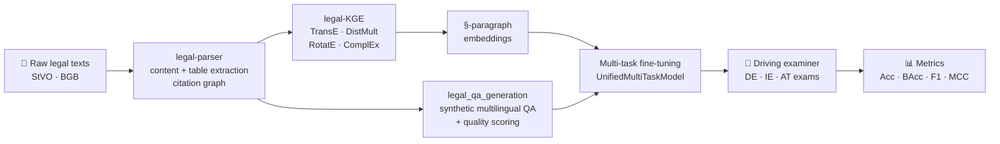

<div align="center">

# 🚦 StVO-LLM-Driver

**Can a language model pass a driving theory exam?**

A research framework for injecting *structured legal knowledge* into language models — and measuring whether it actually helps them apply traffic law.

[](https://www.python.org/)
[](https://pytorch.org/)
[](https://huggingface.co/docs/transformers)
[](https://wandb.ai/)
[]()

</div>

---

## Overview

Large language models can recite traffic rules. Applying them is harder — legal text is hierarchical (`§ 3 (1) 2.`), densely cross-referential, and answering a single exam question often requires composing several paragraphs that never appear together in training data.

**StVO-LLM-Driver** attacks this with a four-stage pipeline built around the German *Straßenverkehrs-Ordnung* (StVO) and *Bürgerliches Gesetzbuch* (BGB):

1. **Parse** raw legal texts into a structured citation **knowledge graph**
2. **Embed** that graph with knowledge-graph embedding models (TransE, DistMult, RotatE, ComplEx)
3. **Fine-tune** language models with a **multi-task objective** that fuses those graph embeddings into the encoder via gated KG-aware attention
4. **Examine** the result on real driving license theory exams — in **German, Irish, and Austrian** test sets

The central question: does grounding a model in the *structure* of the law beat simply training on its *text*?

---

## Pipeline



---

## The model

`UnifiedMultiTaskModel` ([multi_task_classes_STvO_mlm_clm_clu_cls.py](multi_task_classes_STvO_mlm_clm_clu_cls.py)) puts **every task on one shared encoder**, so the loss weights genuinely shape the representation rather than just tuning independent heads.

| Component | What it does |
|---|---|
| **Shared backbone** | Any HF causal (`clm`) or masked (`mlm`) LM |
| **Hierarchical encoder** | Segment-level transformer over structure-aware chunks, for documents far longer than the base context window |
| **KG-aware attention** | Scaled dot-product attention from the text representation over all `§` paragraph embeddings, fused through a learned **sigmoid gate** — the model decides per-dimension how much law to let in |
| **CLM / MLM head** | Core language modeling objective |
| **NSP head** | Next-segment prediction over paragraph pairs |
| **CLU head** | Aligns text representations to KG paragraph embeddings via `CosineEmbeddingLoss` |
| **CLS head** | Yes/no correctness classification for exam answers |

Tasks are combined into a single weighted loss:

```
L = λ_core · L_(clm|mlm+nsp)  +  λ_clu · L_clu  +  λ_cls · L_cls
```

The runner scripts sweep the simplex `λ_core + λ_clu + λ_cls = 1.0` in steps of `0.1`, producing one checkpoint per weighting — which is what lets you read off *how much* structural grounding helps versus pure language modeling.

**Structure-aware segmentation** ([segmenter.py](segmenter.py)) does the chunking: split by section (`§`), then by numbered paragraph `(1)`, then by subpoint `1.` / `a)` / `aa)`, and only then fall back to sentence boundaries — so a chunk never straddles a legal boundary.

---

## Evaluation

[eval.py](eval.py) drives [driving_examiner.py](driving_examiner.py), which runs a model through genuine driving license theory questions.

**Test sets** — German, Irish, and Austrian exams, loaded by [driving_license_data_loader.py](driving_license_data_loader.py), with optional skipping of image-based questions and question categories.

**Answering modes**
- `cls` — direct yes/no classification of each (question, answer) pair
- generation with configurable decoding (`temperature`, `top_p`, `top_k`, `repetition_penalty`)
- `combine` — retrieve the top-`k` most relevant `§` paragraphs by embedding similarity above `--similarity_threshold`, then decide

**Metrics** — accuracy, balanced accuracy, macro precision / recall / F1, micro F1, and **Matthews correlation coefficient**, alongside prediction-distribution diagnostics (`yes` / `no` / `invalid` counts) that expose degenerate always-yes behavior.

### Models benchmarked

Nine legal-domain and general-purpose encoders:

| Model | Domain |
|---|---|
| `nlpaueb/legal-bert-base-uncased` | General legal |
| `nlpaueb/legal-bert-small-uncased` | General legal (small) |
| `nlpaueb/bert-base-uncased-eurlex` | EU law |
| `nlpaueb/bert-base-uncased-echr` | Human rights case law |
| `nlpaueb/bert-base-uncased-contracts` | Contracts |
| `casehold/custom-legalbert` | US case law |
| `dlicari/Italian-Legal-BERT` | Italian law |
| `avichr/Legal-heBERT` | Hebrew law |
| `google-bert/bert-base-uncased` | General baseline |

Every model is evaluated **as a baseline** (`--eval_base`) and again after multi-task fine-tuning at each λ combination.

---

## Repository layout

```
├── legal-parser/                 Stage 1 — legal text → knowledge graph
│   ├── main_content_extractor.py     Structured content extraction
│   ├── table_content_extractor.py    Tables and traffic-sign figures
│   ├── citator.py                    Cross-reference / citation resolution
│   ├── knowledge_graph_constructor.py
│   └── kg_class.py
│
├── legal-KGE/                    Stage 2 — knowledge graph embeddings
│   ├── train_legal_kge.py            TransE · DistMult · RotatE · ComplEx
│   ├── train_transE.py               Standalone TransE trainer
│   ├── extract_paragraph_embeddings.py
│   ├── compare_kge_models.py
│   └── embeddings/                   Pretrained checkpoints (committed)
│
├── legal_qa_generation_multi_lingual.py    Stage 3 — synthetic QA generation
│
├── finetune_multi_task_STvO_mlm_clm_clu.py Stage 4 — multi-task training loop
├── multi_task_classes_STvO_mlm_clm_clu_cls.py  Model, datasets, KG attention
├── segmenter.py                            Structure-aware legal segmentation
│
├── eval.py                       Stage 5 — evaluation entry point
├── driving_examiner.py               Prompting, retrieval, scoring
├── driving_license_data_loader.py    DE / IE / AT exam loaders
├── plotter.py                        Figures and result tables
│
├── slurms/                       SLURM job scripts (HPC)
└── tmux/                         tmux runners (single-node multi-GPU)
```

> **Note** — `data/`, `results/`, `plots/`, `stats/`, and `benchmark/` are excluded from version control. Pretrained KG embeddings under `legal-KGE/embeddings/` **are** committed, so evaluation can be reproduced without re-running stages 1–2.

---

## Getting started

### Installation

```bash
git clone https://github.com/ibrahimssd/stvo-llm-driver.git
cd stvo-llm-driver

python3 -m venv envs/driving-env
source envs/driving-env/bin/activate
bash tmux/install.sh
```

`install.sh` pins **PyTorch 2.6.0 / CUDA 12.4** (H100-ready) and installs `transformers`, `datasets`, `accelerate`, `peft`, `evaluate`, `scikit-learn`, `wandb`, and the plotting stack.

### 1 · Train knowledge-graph embeddings

```bash
python legal-KGE/train_legal_kge.py \
    --model_type transe \
    --data_path data/stvo/stvo_triples.txt \
    --embedding_dim 100 \
    --epochs 100 \
    --negative_sampling type_aware \
    --save_paragraph_embeddings \
    --output_dir legal-KGE/embeddings/transe/STvO_de
```

### 2 · Multi-task fine-tuning

```bash
python finetune_multi_task_STvO_mlm_clm_clu.py \
    --base_model_name nlpaueb/legal-bert-base-uncased \
    --modeling_type masked \
    --legal_text STVO \
    --clm_data_path  data/stvo/clm.json \
    --nsp_data_path  data/stvo/nsp.json \
    --clu_data_path  data/stvo/clu.json \
    --cls_data_path  data/stvo/cls.json \
    --paragraph_embeddings_file legal-KGE/embeddings/transe/m2m100_418M_STvO/transe_paragraph_embeddings_best.json \
    --clm_nsp_lambdas 0.0 0.2 0.4 0.6 0.8 1.0 \
    --cls_lambdas 0.1 \
    --num_epochs 20 --max_segments 10
```

### 3 · Sit the exam

```bash
python eval.py \
    --data_path data/test-sets/irish-driving-license.json \
    --data_name irish \
    --baseline_model nlpaueb/legal-bert-base-uncased \
    --model_checkpoint_dir  <checkpoint-dir> \
    --model_checkpoint      m2m100_418M_clm_nsp_0.4_clu_0.5_cls_0.1.pt \
    --paragraph_embeddings_file legal-KGE/embeddings/transe/m2m100_418M_STvO/transe_paragraph_embeddings_best.json \
    --modeling_type masked --task_type cls --num_cls_labels 2 \
    --decoding combine --similarity_threshold 0.6 \
    --skip_images --skip_category direct_answer \
    --results_file results/irish-legal-bert.csv
```

Add `--eval_base` to score the untuned baseline instead.

### Batch experiments

Full sweeps are already scripted — pick the runner that matches your cluster:

```bash
cd tmux   && bash stvo_train_multi_task.sh   # tmux, manual GPU selection
cd slurms && sbatch stvo_train_multi_task_ultimate.sm   # SLURM
```

Both handle venv creation, Hugging Face cache setup, W&B directories, GPU logging, and timestamped `out/` + `err/` logs.

---

## Key configuration

| Flag | Purpose | Typical |
|---|---|---|
| `--modeling_type` | `causal` or `masked` backbone | `masked` |
| `--task_type` | Active head: `clm` · `mlm` · `cls` · `clu` | `cls` |
| `--clm_nsp_lambdas` | Core LM loss weights to sweep | `0.0 … 1.0` |
| `--cls_lambdas` | Classification loss weights | `0.1` |
| `--max_segments` | Segments per document (hierarchical encoder) | `10` – `20` |
| `--similarity_threshold` | Min. similarity for `§` retrieval | `0.6` |
| `--decoding` | `combine` enables KG-grounded retrieval | `combine` |
| `--translator_model_name` | NMT model for the DE→EN axis | `m2m100_418M` |
| `--legal_text` | Source corpus | `STVO` / `BGB` |

---

## Multilingual QA generation

[legal_qa_generation_multi_lingual.py](legal_qa_generation_multi_lingual.py) turns legal sentences into supervised QA pairs using an instruction-tuned LLM, with domain-aware prompting, robust JSON recovery from model output, a **quality score** per pair, and validation with configurable retries — so the synthetic training data is filtered rather than blindly trusted.

```bash
python legal_qa_generation_multi_lingual.py \
    --input_file data/stvo/structured_stvo.json \
    --output_file data/synthetic-data/stvo_qa_de.json \
    --language de --domain_type traffic \
    --pairs_per_sentence 2 --min_quality_score 0.7
```

---

## Citation

If this work is useful in your research, please cite the repository:

```bibtex
@software{stvo_llm_driver,
  author = {Ibrahim Siddig},
  title  = {StVO-LLM-Driver: Knowledge-Graph-Grounded Multi-Task Learning
            for Legal Reasoning in Driving License Examinations},
  year   = {2026},
  url    = {https://github.com/ibrahimssd/stvo-llm-driver}
}
```

---

<div align="center">

*Research code — interfaces may change between experiment iterations.*

</div>
